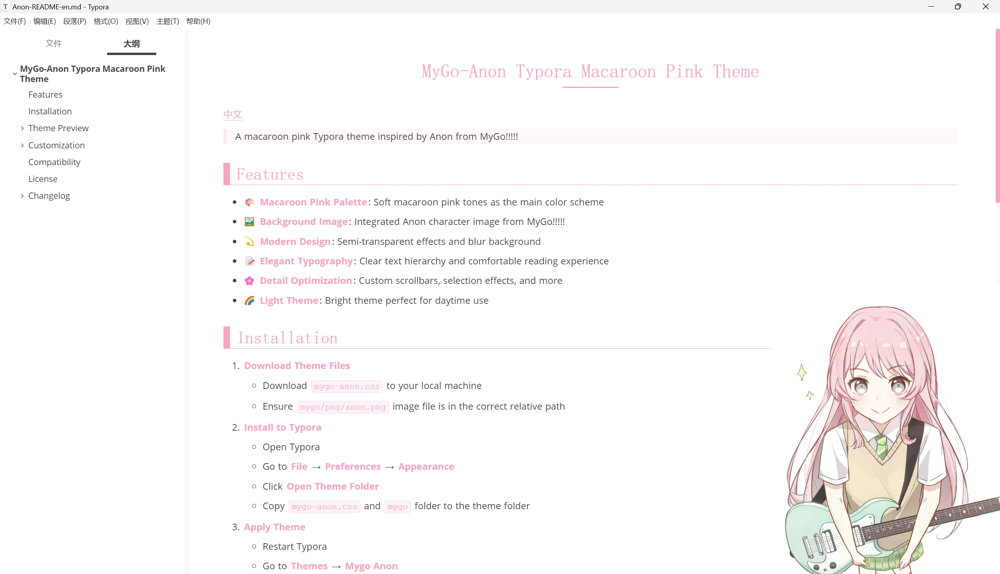
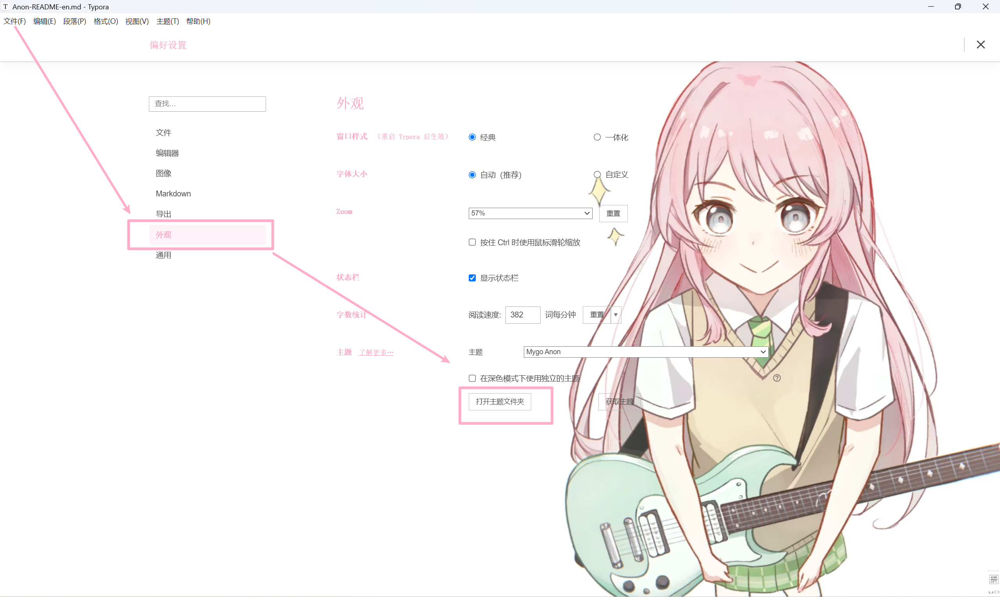

# Typora-lvy-theme

一个为 Typora 设计的 MyGo!! 主题集合

## 主题预览

### 配置主题

## 包含主题

- **MyGo Anon** - 马卡龙粉色明亮主题，适合日间使用
- **MyGo Mortis** - 马卡龙绿色暗黑主题，适合夜间使用（test ing）

## 安装方法

1. 下载主题文件（`.css` 文件）
2. 打开 Typora → 文件 → 偏好设置 → 外观 → 打开主题文件夹
3. 将主题文件和 `png` 文件夹复制到主题文件夹中
4. 重启 Typora，在主题菜单中选择对应主题

## 特色功能

- 🎨 马卡龙色调配色方案
- 🖼️ MyGo!!!!! 角色背景图片
- 🌙 深色/浅色主题支持
- 📝 优化的排版和可读性
- 🎯 完整的 Markdown 元素样式支持

## Dark主题预览

---

**MyGo!!!!!** 是一部关于女子乐队的动画作品，这些主题致敬了这部优秀的作品！🎸✨
